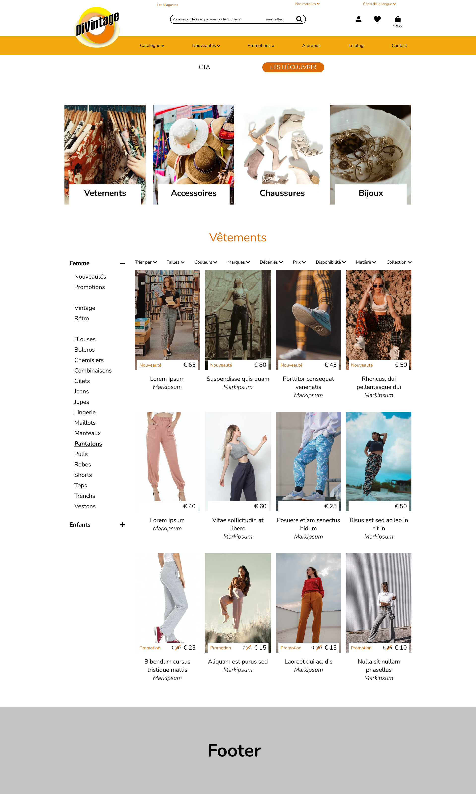

# DiVintage-FrontEnd
## Dev HTML/CSS
* [Header & Navbar](https://nathalie-anneessens.github.io/DiVintage-FrontEnd/header-navbar.html)
### Coming soon
* [Home page](#)
* [Catalogue](#)
* [Article](#)

## Maquettes

## TO DO
### 12/08
#### **Header & Navbar**
- [x] Mettre le background color sur la navbar
- [x] Designer le formulaire de recherche
- [ ] Rendre le Menu responsive
  - [x] Trouver [des ressources  ASP.NET](https://ej2.syncfusion.com/aspnetcore/documentation/menu/getting-started/) pour le faire
  - [ ] Attaquer ça -> demain
### 16/08
#### **Maquette V1.0**
- [x] Page catalogue
- [ ] Page article
- [ ] 
   

